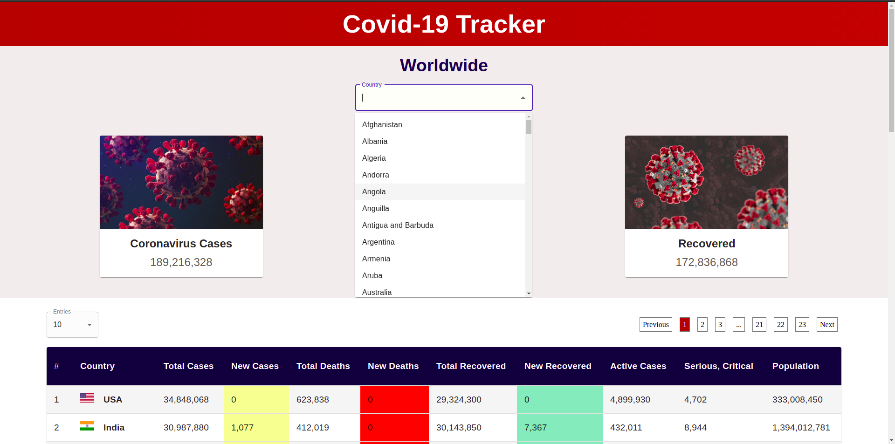
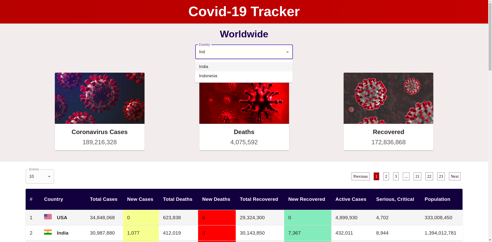
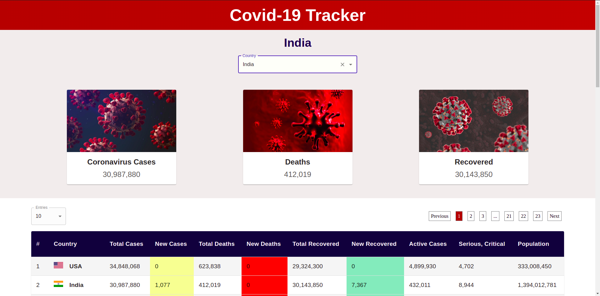
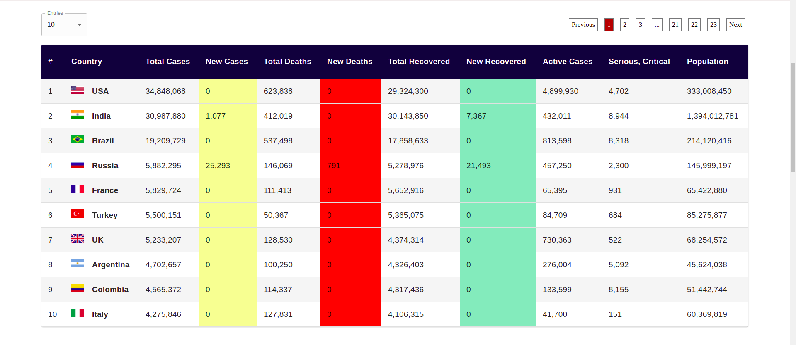
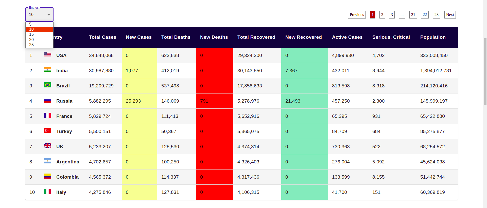
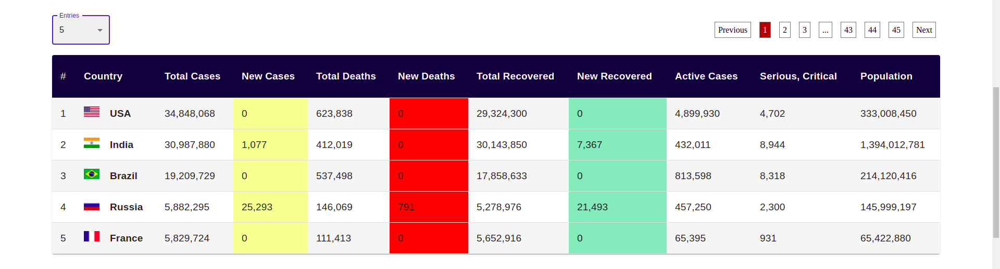
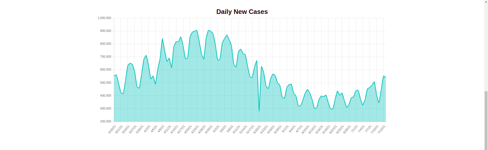
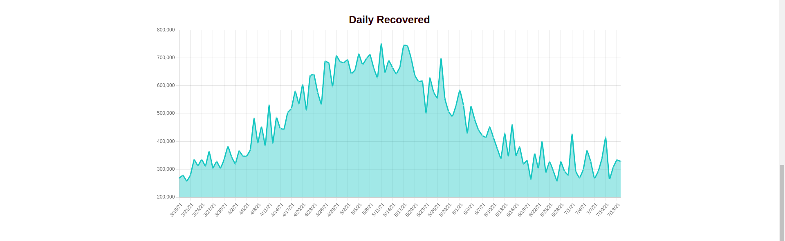
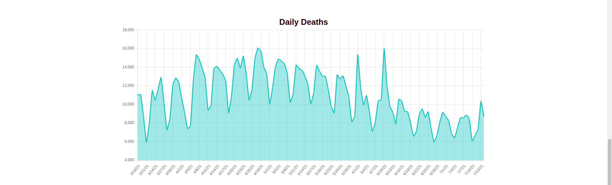
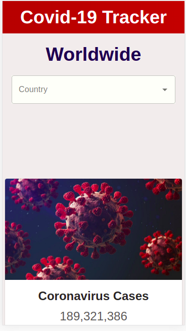

# Covid-19 Tracker
### A web app that is fully responsive and has live data for Covid-19 related details like total cases, total active cases, total recovered, total deaths etc. for all countries.

### An autocomplete dropdown list to select different countries.

### Eg. India.

### Details of the selected country will be highlighted in the cards.

### Table containing details of all countries in descending order of total cases.

### From the entries dropdown we can select the number of rows that we want to be shown per page.

### Eg. 5

### Graph of daily new cases

### Graph of daily recovered

### Graph of daily deaths

### Mobile view of the application

